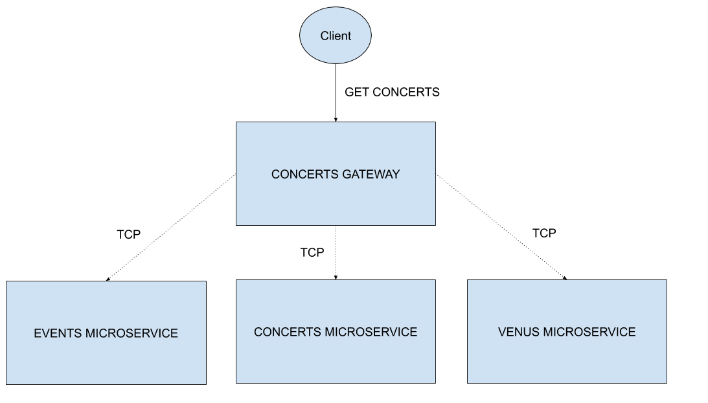
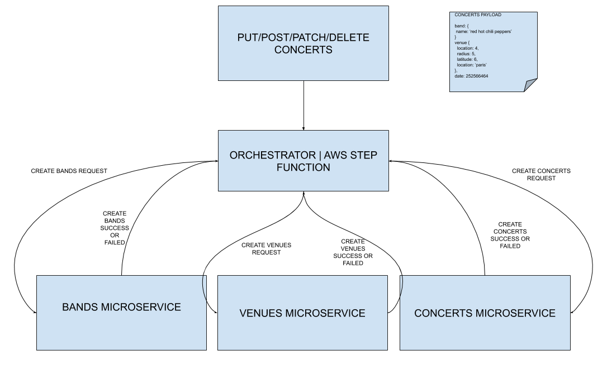
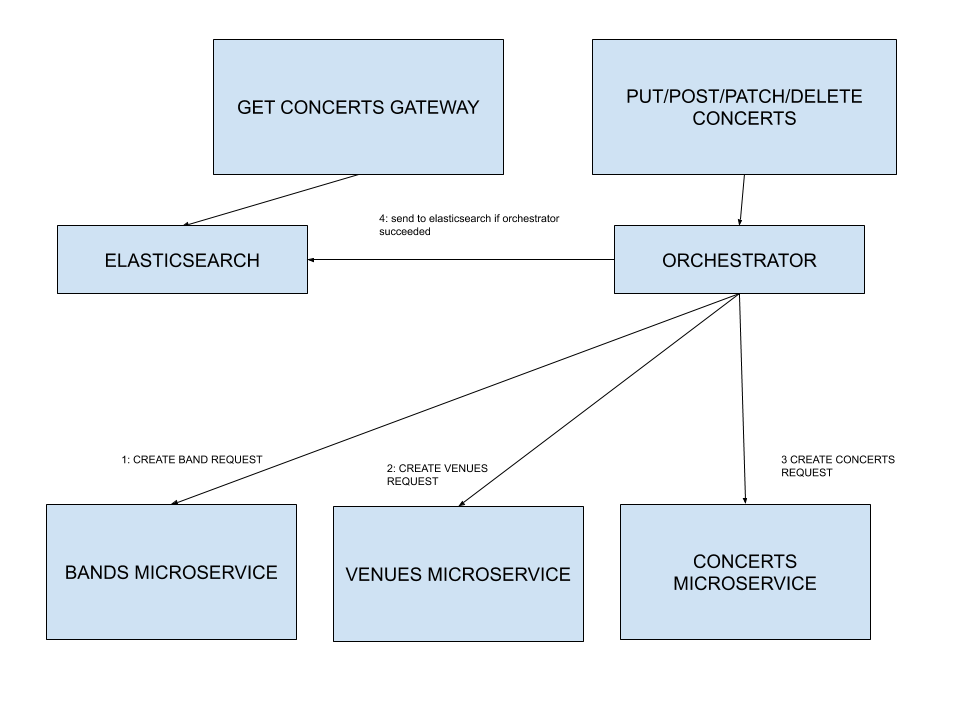

# MONOREPO WITH MICROSERVICES

## OVERALL
Following https://gitlab.com/wemaintain-public/backend-test

The purpose of this project was to build an API capable of displaying a list of concerts.

### STACK
- nestjs as monorepo - For building the architecture
- mongodb - Used for database
- docker - Used to build the database for each microservices
- ajv - Used for validation of the inputs

### ARCHITECTURE
Each entity has been treated as a micoservice. Which means that each one of them have its own database.


In order to make the API call there is a gateway called 'concerts-gateway' responsible of:
- Handling the client request
- Parsing the inputs and doing a basic validation (either bandIds or longitude|latitude|radius must be specicied in the query parameter, the specifi treatment is handled by each microservices (such as min value for the longitude being validated by the venue microservice)
- Requesting each microservice
- Aggregating the result

#### MONOREPO ARCHITECTURE

##### Apps folder contains
- **concerts**: The concerts microservice
- **events**: The events microservice
- **venues**: The venues microservice
- **concerts-gateway**: The gateway client responsible of aggregating all the microservices
##### Libs folder contains
- **exceptions**: Errors shared by the microservices
- **validator**: A service that each microservices will use for input validation (no business logic though)
- **bands-model**: Base interface for Band entity used for both bands microservice and concerts-gateway
- **venues-model**: Base interface for Venue entity used for both venues microservice and concerts-gateway
- **concerts-model**: Base interface for Concert entity used for both concerts microservice and concerts-gateway

### REASON FOR MONGODB
Since We are only doing read requests (high read perf required for a low perf write tradeof) we are on a 1 microservice-1 database architecture, there is no need for using a SQL database (for foreign key usage and joins) and mongodb handles pretty well geolocation requests https://docs.mongodb.com/manual/tutorial/geospatial-tutorial/

### REASON FOR MONOREPO APPROACH
Ideally each microservices should have its own repository and common code should be in a monorepo (handled with lerna)  but for the sake of the test I have decided to set everything up in the same repository

### MAKEFILE
Since the project is dockeriez there is a Makefile in the project,

#### SETTING UP THE PROJECT
```
make
```
This will generate the .env file from the .env.example file and install dependencies of the project

#### RUNNING THE PROJECT
```
make start
```
This will run the database container for each microservice and laun

#### TESTING THE PROJECT
```
make test
```
This will run all the tests on the project and display coverage

#### SWAGGER
Swagger is accessible on http://localhost:3000/api (port by default set in .env by GATEWAY_HTTP_PORT)

# LIMITATIONS AND POSSIBLE IMPROVEMENTS (STEP2)

As requested here https://gitlab.com/wemaintain-public/backend-test, what would happen if we were handling millions of data ?

#### CONCERTS GATEWAY

##### IMPROVEMENT
Since the concerts gateway is doing an aggregation, the performances are abysmal as the dataset will grow.
So instead of doing an aggregation, there could be a elastic search in the concerts gateway. Elastic search is oriented for fast response times (and distributing the data through replicas to overcome database failure, if one node comes down another one will be available)

The concerts gateway would then stay a read only endpoint.


There would be a gateway handling POST|PUT|PATCH|DELETE requests. To handle possible failures and rollback we cannot rely on database transactions since we are on an microservices environement. Instead we have to build or own transaction mechanism.
Hence, using an orchestrator (even better if we use **aws step function** to handle this) would allow to manipulate the writes operations.
The order creation would be
- bands
- venues
- concerts

For example if an operation failed,for example POST venues, whereas POST bands had succeeded, we can request a DELETE on the newly created band



After that, we could trigger an event at the end of the creation to send the newly created entities in elastic search
Therefore we would have the following new architecture



##### DRAWBACKS
Elasticsearch is not great for data consistency since its oriented in both availability and partition tolerance(with nodes) so there could be inconsistency in the returned data because since there are replicas, it is eventually consistent from one node to another, furthermore writes operations are expansive.

If using aws step function, it can become expensive if writes requests are frequent, and without it the orchestrator could become a hassle to maintain because of its complexity. Overall both elasticsearch and the orchestrator will be the main points of the architecture to monitor.

#### HOW TO MONITOR
If using aws step function, its possible to monitor the execution of the state machine through the aws console
Elastic search offers a monitoring solution to analyze its nodes and documents

#### COMMUNICATIONS WITH MICROSERVICES

##### IMPROVEMENT
Instead of using TCP we could use GRPC to communicate between microsrervices and transmited data would be in binary which will be faster than JSON
##### DRAWBACKS
Possible increased complexity for the project and non human readable data since its binary, and testing would then become tricky
